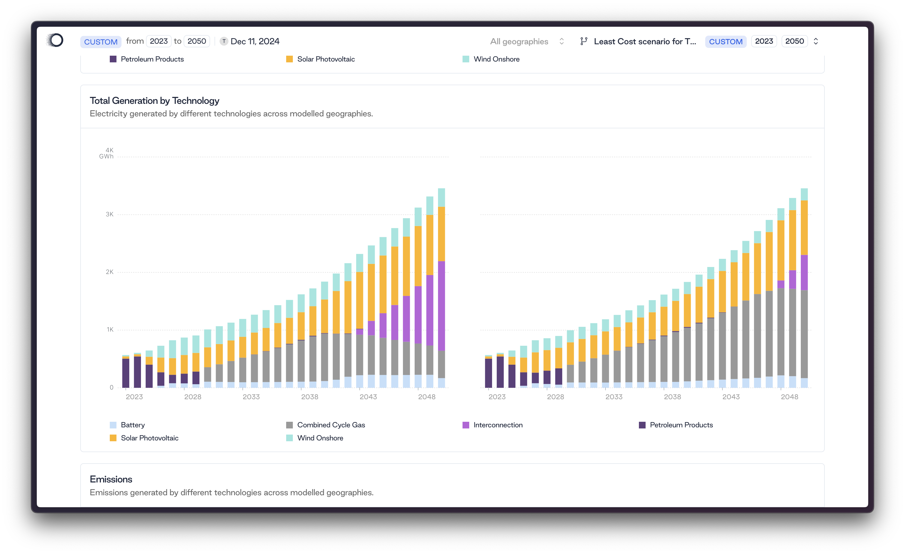

# Frontend Engineering Exercise

You are building a data visualisation tool for an energy analyst at TransitionZero. The analyst has multiple datasets containing **energy generation for Indonesia** from 2023 to 2050, and they need a web-based interface to explore, visualise, and compare these datasets effectively.

**Mock API:**
The project includes a mock API server that serves two datasets (`indonesia-generation-medium-resolution.json`, `indonesia-generation-high-resolution.json`) via REST endpoints, allowing for dynamic data loading and filtering capabilities. The dataset:
   - Contains energy generation values in Megawatts (MW) for various energy technologies
   - Covers years 2023-2050 with annual data points
   - Technologies include: Solar, Wind, Gas, Nuclear, Hydro, Coal, Geothermal, and more

The mock API provides the following endpoints:

- `GET /api/datasets` - List all available datasets
- `GET /api/datasets/:id` - Get specific dataset
- `GET /api/datasets/:id/filter` - Get filtered dataset (with query parameters)
- `GET /api/datasets/:id/summary` - Get dataset summary statistics
- `GET /api/health` - Health check

## Requirements

You need to build a web app that provides the analyst with features to explore and compare multiple energy generation scenarios. The application should fetch data from the mock API efficiently while maintaining smooth user interactions. The following are required:

1. User should be able to view responsive stacked bar charts rendering any of the dataset provided
2. User should be able to compare medium vs. high resolution generation data through side-by-side views or combined visualisations
3. User should be able to hover over data points to see precise energy values (MW) for each technology at specific timestamps
4. User should be able to filter and show/hide specific energy carriers (Solar, Wind, Gas, Nuclear, etc.)

The focus should be on creating a **clean, performant, and user-friendly interface** that helps the analyst understand energy patterns and compare medium vs. high resolution generation scenarios across different technologies and time periods.

---

Feel free to take inspiration from [Scenario Builder](https://builder.transitionzero.org/tz/The-Gambia/Current-Policy-scenario-for-The-Gambia?compare=Least-Cost-scenario-for-The-Gambia)


*Visual comparison of two generation datasets.*


## Time & Submission

**Time Limit:** 1 - 2 hour

We believe this exercise can be completed within 2 hours, so please do not exceed the time limit. If you find yourself with more time after completing the exercise, feel free to take your solution further and simply document your additions in `docs.md`. If you find any requirements unclear, please add them to the document and include any assumptions made. If any requirements are unclear, please note them in the document along with any assumptions you make.

**AI Tools & Modern Workflow:**
We actively encourage the use of AI design and development tools in your workflow. We use them day-to-day and would love to see how you leverage them to improve your development process. Feel free to use tools like: [Cursor](https://cursor.so/), [v0.dev](https://v0.dev/), or any other AI tools that help you work more efficiently

**Submission:**
- Required: GitHub pull request
- Optional: Document your approach, decisions, and notes in `docs.md`
- Optional: Deploy to Vercel, Netlify, or similar platform

We encourage good version control practices by making multiple commits with clear, descriptive messages and providing a well-written PR description with your submission.


**Presentation:**
You'll be invited to walk through your solution in a 1-hour session where we'll discuss your implementation, decisions, and how you used AI tools in your workflow. This task will form the jumping off point for a short code-pairing exercise in your technical interview.

## Setup

The project comes with a basic chart component that you can build upon. The application is set up with a modern React development environment.

### Environment Variables

Copy the example environment file and configure your API settings:

```bash
cp .env.example .env
```

### Development

```bash
# Install dependencies
npm install

# Start both the API server and frontend development server
npm run dev
```

This will start:
- Mock API server on http://localhost:3001
- Frontend development server on http://localhost:5173

### Alternative Commands

If you need to run servers individually:

```bash
# Start only the API server
npm run api

# Start only the frontend development server
npm run dev:frontend
```

**Tech Stack:**
- React + TypeScript
- Tailwind CSS
- Vite
- Recharts (for data visualisation)
- Shadcn/ui components
- Express.js (for mock API)

**Starting Point:**
You've been provided with a basic stacked bar chart component in `src/components/ui/chart.tsx` that you can extend and enhance. The chart currently renders a single dataset - you'll need to modify it to handle fetch from the API.

**Note:** While the project is set up with React + TypeScript + Vite, feel free to use any tech stack of your choice within the React ecosystem. Feel free to rewrite the application using your preferred framework, libraries, and tools.

